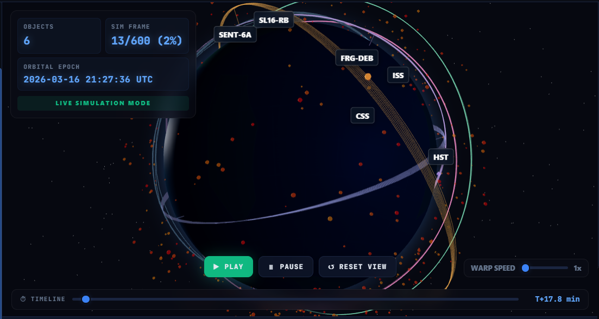

# Simulation Speed & Trajectory Visuals Refinement

The current simulation speed at 1x is significantly faster than real-time, and the trajectory paths are static loops that feel like "threads". This plan addresses these issues for a more realistic and polished experience.

## Proposed Changes

### Animation Speed
- **Implement Real-Time 1x Speed**: Use `THREE.Clock` to get frame deltas and calculate the frame increment based on the `prop_window` returned by the server. 
- **Warp Speed Scaling**: Ensure the warp speed slider correctly multiplies this base real-time speed.

### Trajectory Visuals
- **Dynamic Trailing Orbits**: Instead of rendering complete static loops, update the orbit paths to be "dynamic tails".
- The trajectory will show a leading/trailing window of the orbit (e.g., 20% of the orbit) that moves with the satellite.
- Use `Line` instead of `LineLoop` and update the geometry points during the [animate](file:///home/sibikrish/projects/Project-Epoch-Zero/static/app.js#571-668) loop to create a "streaming" effect.

---

### Frontend Components

#### [MODIFY] [app.js](file:///home/sibikrish/projects/Project-Epoch-Zero/static/app.js)
- Initialize `THREE.Clock` in [init()](file:///home/sibikrish/projects/Project-Epoch-Zero/static/app.js#28-141).
- Update [animate()](file:///home/sibikrish/projects/Project-Epoch-Zero/static/app.js#571-668):
    - Compute `animFrame` increment based on `clock.getDelta()`, `scanData.prop_window`, and `animSpeed`.
    - Update trajectory geometries every frame (or every few frames) to show a sliding window of points centered on the current frame.
- Update [populateScene()](file:///home/sibikrish/projects/Project-Epoch-Zero/static/app.js#444-504):
    - Create dynamic `BufferGeometry` for each satellite's trajectory.
    - Store the full trajectory data in `userData` for efficient slicing.

## Verification Plan

### Manual Verification
1. **Speed Test**: Set warp speed to 1x and observe the simulation clock. It should increment at roughly 1 second per real second.
2. **Trajectory Visuals**: Check the globe to see if the satellite orbits now look like moving lines/tails rather than static rings.
3. **Scrubbing**: Ensure the timeline scrubber still works smoothly with the dynamic trajectory markers.
